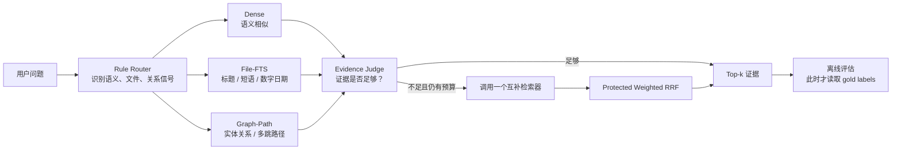

# 轻量级任务感知多索引智能体搜索

> 用最多两次检索调用，在 Dense、File-FTS、Graph-Path 三种索引之间动态选择，低成本找回回答问题所需的完整证据。

这是一个**检索研究项目**，不是问答生成系统。输入一个问题后，系统返回 Top-k 证据文档，并评估是否找到了全部 gold documents。

当前冻结实验包含 3,500 篇文档、180 个问题。最终 `two_stage_agent` 的 **Complete@5 为 85.56%**，与固定调用全部三个检索器的 Fusion 持平；平均工具调用从 3.00 次降到 **1.44 次**。

## 一眼看懂



核心约束：

- Router 和 Judge 在运行时看不到任务标签和 gold evidence。
- 每题最多调用两个核心检索器。
- 最终数据只用于一次性评估，不能用于调参。
- `oracle` 会读取 gold labels，只是分析上界，不能部署。

## 冻结结果

以下数据来自 [`results/final/main_results.csv`](results/final/main_results.csv) 的整体 @5 结果：

| 方法 | Complete@5 | Evidence@5 | MRR | 平均调用数 |
|---|---:|---:|---:|---:|
| Dense | 74.44% | 91.67% | 80.19% | 1.00 |
| File-FTS | 78.89% | 98.33% | 90.88% | 1.00 |
| Graph-Path | 82.22% | 92.78% | 79.69% | 1.00 |
| Rule Router | 82.22% | 96.67% | 88.14% | 1.00 |
| Fusion | 85.56% | 97.22% | 89.35% | 3.00 |
| **Two-Stage Agent** | **85.56%** | **96.67%** | **87.81%** | **1.44** |
| Oracle（仅分析） | 90.00% | 98.33% | 94.58% | 1.00 |

最重要的结论：单一检索器各有所长；两阶段 Agent 用按需切换取得了与全量 Fusion 相同的 Complete@5，但只使用约一半的工具调用。

## 3 分钟开始

### 1. 安装

建议使用 Python 3.10–3.12。在仓库根目录执行：

```powershell
python -m venv .venv
.\.venv\Scripts\Activate.ps1
python -m pip install --upgrade pip
pip install -r requirements.txt
```

### 2. 验证数据隔离

这个命令只检查运行时公开视图，不执行检索，也不需要 API token：

```powershell
python experiments/run_experiment_box.py `
  --method file_fts `
  --split final `
  --validate-inputs-only
```

预期看到：

```json
{
  "runtime_documents": 3500,
  "runtime_questions": 180,
  "split": "final"
}
```

### 3. 运行无需 API 的基线

```powershell
.\experiments\run_baseline.ps1 -Method file_fts
.\experiments\run_baseline.ps1 -Method graph_path
```

结果写入 `results/final/`，索引写入 `indexes/final/`。

### 4. 运行 Dense 或两阶段 Agent

Dense 使用 DeepInfra 的 `sentence-transformers/all-MiniLM-L6-v2` embedding 接口。token 只放环境变量：

```powershell
$env:DEEPINFRA_TOKEN="你的 token"

.\experiments\run_baseline.ps1 -Method dense -RebuildDense

python experiments/run_experiment_box.py `
  --method two_stage_agent `
  --split final `
  --ks 1,3,5

Remove-Item Env:\DEEPINFRA_TOKEN
```

仓库已经包含冻结索引和正式结果；只想阅读或分析项目时，不需要重新调用远程 API。

## 项目结构

```text
.
├── README.md                 # 从这里开始
├── config.yaml               # 数据、检索器、Router、Judge、实验参数
├── requirements.txt
│
├── src/                      # 可复用的核心实现
│   ├── agent.py              # 两阶段控制流与 protected weighted RRF
│   ├── router.py             # 首轮工具选择
│   ├── evidence_judge.py     # 停止 / 切换判断
│   ├── dense_search.py       # Dense 检索
│   ├── file_fts_search.py    # SQLite FTS5 文件式检索
│   ├── graph_path_search.py  # 图路径检索
│   ├── experiment_box.py     # 反污染运行与评价边界
│   └── metrics.py            # 检索指标
│
├── experiments/              # 命令行入口：构建、运行、评估、导出
├── data/final/               # 冻结数据、构建输入、manifest
├── indexes/final/            # 冻结检索索引
├── results/
│   ├── final/                # 正式预测、逐题指标、汇总
│   └── analysis/             # 基线与 Agent 的派生分析表
├── figures/
│   ├── agent/                # Router / Agent 分析图
│   └── baselines/
│       ├── all_methods/      # 含 Fusion、Oracle 的完整比较
│       └── core_only/        # 历史核心基线比较
├── docs/
│   ├── PROJECT_SPEC.md       # 实验协议
│   ├── DATASET_BUILD.md      # 数据集构建与冻结细节
│   ├── BASELINES.md          # 基线定义
│   └── reports/              # 完整 Word 报告
└── tools/                    # 图表与报告生成器
```

目录原则很简单：

- **改算法**：看 `src/`
- **跑实验**：看 `experiments/`
- **查数据**：看 `data/final/`
- **看结论**：看 `results/final/main_results.csv`
- **看图和报告**：看 `figures/` 与 `docs/reports/`

## 三种检索器为什么互补

| 检索器 | 主要信号 | 最适合 | 典型弱点 |
|---|---|---|---|
| Dense | 向量语义相似度 | 同义改写、语义事实 | 多跳时容易只找到部分证据 |
| File-FTS | FTS5、字段权重、标题/短语/数字日期加分 | 文件定位、精确锚点 | 不擅长补全关系链 |
| Graph-Path | 文档—句子—实体—关系路径、beam search | 实体关系、多跳证据组合 | 依赖实体抽取与图质量 |

Router 先选择最可能有效的检索器。Evidence Judge 再根据首轮分数、标题、实体覆盖和精确锚点决定停止，或调用一个互补工具。若发生第二轮，Agent 使用 protected weighted RRF 合并两轮结果，并保护首轮中高置信文档。

## 数据与评价

冻结数据：

- `data/final/corpus.jsonl`：3,500 篇文档
- `data/final/questions.jsonl`：180 个问题
- `semantic_fact`：60 题
- `multi_hop_relation`：60 题
- `exact_file_lookup`：60 题

主要指标：

- **Evidence Recall@k**：Top-k 至少找到一个 gold document
- **Complete Evidence Recall@k**：Top-k 找到全部 gold documents
- **MRR**：第一个正确证据的排序质量
- **Average Tool Calls**：每题调用的核心检索器数量

多跳任务需要同时找到两篇 gold documents，因此 Complete Recall 是本项目最关键的指标。

## 常用命令

运行任一正式方法：

```powershell
python experiments/run_experiment_box.py `
  --method <dense|file_fts|graph_path|rule_router|two_stage_agent> `
  --split final `
  --ks 1,3,5
```

检查预测文件是否泄露 gold 字段：

```powershell
python experiments/check_no_gold_leakage.py `
  results/final/two_stage_agent_final_predictions.jsonl
```

重新汇总正式结果：

```powershell
python experiments/summarize_results.py
```

重新生成分析表与图：

```powershell
python experiments/export_baseline_results.py
python experiments/visualize_baseline_results.py
python tools/generate_agent_visualizations.py
```

## 文档入口

- [项目协议](docs/PROJECT_SPEC.md)
- [数据集构建与冻结说明](docs/DATASET_BUILD.md)
- [正式基线说明](docs/BASELINES.md)
- [数据集卡片](data/final/DATASET_CARD.md)
- [最终项目报告](docs/reports/最终项目报告_轻量级多索引智能体搜索.docx)
- [Router 与 Agent 设计及结果](docs/reports/router_and_agent_design_and_results.docx)
- [基线实验报告](docs/reports/冻结基线实验设计与结果分析报告.docx)

## 反污染规则

- 不使用 final 结果调整 Router、Judge、检索器权重、阈值、prompt 或题目。
- 运行时方法只能读取公开问题字段和公开语料字段。
- 预测写盘并通过泄露检查后，评价脚本才读取 gold labels。
- 后续方法设计必须使用独立验证集；`data/final/` 只用于固定评估。
